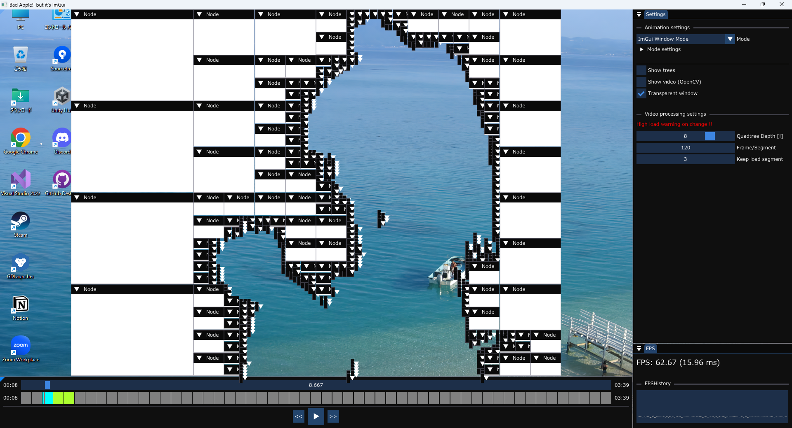

# Bad Apple!! but it’s ImGui

---

# 概要

このプロジェクトは四分木空間分割を使って、Bad Apple!!の影絵をImGui上で再現するという技術デモです。
ただ再現するだけではなく、動画のバッチ処理（ストリーミング処理）やメモリ使用量を削減することで、効率的に処理負荷を抑えるようにしています。

---

# インストール/使い方

最初にAssetsフォルダにBad Apple!!の動画と音声ファイルをダウンロードする必要があります。（ファイルがない場合はエラーが発生し、実行できません）
詳細はAssets/README.mdを参照してください。

Playerウィンドウ（画像下部）の再生マークボタンを押すと、処理された動画が再生されます。
Animation settingsにあるModeを切り替えることで表示方法を変えることができます。

## ボタン/設定項目の説明

### Settings/Animation settings

- **Mode**
    
    表示方法を変更。ImPlotのグラフ上で表示、矩形表示、ImGuiウィンドウ表示の３つから選択できます。
    また、Mode settingでモードごとの設定ができます。
    
- **Show trees**
    
    表示時に矩形ごとに色分けします。
    
- **Show video**
    
    元動画を別ウィンドウで表示します。
    
- **Transparent Window**
    
    表示画面を透過します。
    ただし、Windows Aeroが有効化になっていないと使用できません。
    また、表示画面をメインウィンドウから外した場合は透過されません。
    

---

### Settings/Video processing settings

※ここの設定は変更時にPCに大きな負荷がかかるため気をつけてください。

- **Quadtree Depth**
    
    四分木空間分割の最大分割レベルを設定します。
    
- **Frame/Segment**
    
    ストリーミング処理に関する設定です。
    １区間あたり何フレームにするかを設定できます。
    
- **Keep load segment**
    
    ストリーミング処理に関する設定です。
    常に読み込む区間の数を設定できます。
    常に読み込まれるフレーム数は、Keep load segment * Frame/Segmentになります。
    

---

### Player

- **スライダー**
    
    現在の再生位置です。移動もできますが、読み込み区間外の指定した場合は同期で読み込むため、一時的にアプリケーションがフリーズします。
    
- **読み込み区間**
    
    灰色と緑と水色の表の部分のことを言います。
    現在の読み込み区間とその状態を把握することができます。
    
    緑：現在読み込まれている区間
    水色：現在読み込まれている区間＋現在の再生位置の区間
    灰色：読み込まれていない区間
    赤色の線：現在の再生位置
    

---

# ビルド方法

このアプリケーションは次のライブラリを使用しています。
ビルドするには、次のライブラリを指定した場所にインストールする必要があります。
（ライセンス上、このプロジェクトには最初から含まれていません。）

- FMOD Core API
    
    次のURLからFMOD Studio (2.03.08)をダウンロードし、指示通りダウンロードします。
    インストール場所は変えないでください。（C:\Program Files\FMOD SoundSystem\FMOD Studio 2.03.08)
    [https://www.fmod.com/download](https://www.fmod.com/download)
    
    (FMOD_API_DIR)\core\inc のファイルを ThirdParty\FMOD\Inc\fmod にコピー
    (FMOD_API_DIR)\core\lib のファイルを ThirdParty\FMOD\Lib にコピー
    ※(FMOD_API_DIR)はSDKのファイルパス
    
- OpenCV
    
    次のURLからOpenCV 4.12.0をダウンロードし、実行後、適当な場所に展開します。（opencv-4.12-windows.exe）
    [https://github.com/opencv/opencv/releases/tag/4.12.0](https://github.com/opencv/opencv/releases/tag/4.12.0)
    
    opencv\build\include\opencv2を、ThirdParty\OpenCV\Incにコピー
    opencv\build\x64\vc16\libを、ThirdParty\OpenCV\Libにコピー
    opencv\build\x64\vc16\binを、ThirdParty\OpenCV\Libにコピー
    opencv\build\binを、ThirdParty\OpenCV\Libにコピー
    

インストールが完了したら、動画と音声をAssetsにダウンロードし、ソリューションを開いて実行します。

---

# 開発環境

- OS: Windows 11
- 言語: C++23(MSVC)
- ライブラリ/エンジン: DirectX11, stb_image, OpenCV, FMOD, ImGui, ImPlot,

# 免責事項

いかなる場合においても開発者は、本アプリケーションの使用に起因または関連して生じる直接的、間接的、偶発的、
または結果的な損害を含むがこれに限定されない、いかなる損害についても責任を負わないものとします。

Made using FMOD Studio by Firelight Technologies Pty Ltd.
Copyright © 2025 himawarialadin All rights reserved.