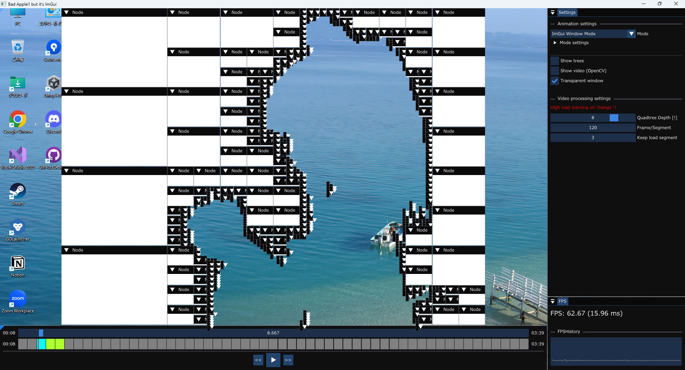

# Bad Apple!! but it’s ImGui (Windows)

---

### 参考元

[Bad Apple but it&#39;s a Windows virus - YouTube](https://www.youtube.com/watch?v=EZpZwunMzuE&t=35s)

### Special Thanks

ImGui / ocornut : [GitHub - ocornut/imgui: Dear ImGui: Bloat-free Graphical User interface for C++ with minimal dependencies](https://github.com/ocornut/imgui)

BadApple!! PV【影絵】/ あにら氏 : https://www.nicovideo.jp/watch/sm8628149

---

# 概要

このプロジェクトは四分木空間分割を使って、
Bad Apple!!の影絵をImGui上で再現するという技術デモです。  
ただ再現するだけではなく、動画のバッチ処理（ストリーミング処理）や
メモリ使用量を削減することで、効率的に処理負荷を抑えるようにしています。  

---

# インストール/使い方

Releaseから最新のzipをダウンロードし、展開します。
最初にAssetsフォルダにBad Apple!!の動画と音声ファイルをダウンロードしてください。
（ファイルがない場合はエラーが発生し、実行できません）  
詳細はAssets/README.txtを参照してください。  

Playerウィンドウ（画像下部）の再生マークボタンを押すと、
処理された動画が再生されます。  
Animation settingsにあるModeを切り替えることで表示方法を変えることができます。

## 動作環境

- Windows10、またはそれ以上

- DirectX11が動作する環境
  （NVIDIA GTX400シリーズ以降、AMD HD 5000シリーズ以降)

- [オプション] Windows Aeroが使用可能

---

## ボタン/設定項目の説明

### Settings/Animation settings

- **Mode**
  
    表示方法を変更。ImPlotのグラフ上で表示、
    矩形表示、ImGuiウィンドウ表示の３つから選択できます。  
    また、Mode settingでモードごとの設定ができます。

- **Show trees**
  
    表示時に矩形ごとに色分けします。

- **Show video**
  
    元動画を別ウィンドウで表示します。

- **Transparent Window**
  
    表示画面を透過します。  
    ただし、Windows Aeroが有効化になっていないと使用できません。  
    また、表示画面をメインウィンドウから外した場合は透過されません。

---

### Settings/Video processing settings

※ここの設定は変更時にPCに大きな負荷がかかるため気をつけてください。

- **Quadtree Depth**
  
    四分木空間分割の最大分割レベルを設定します。

- **Frame/Segment**
  
    ストリーミング処理に関する設定です。  
    １区間あたり何フレームにするかを設定できます。

- **Keep load segment**
  
    ストリーミング処理に関する設定です。  
    常に読み込む区間の数を設定できます。  
    常に読み込まれるフレーム数は、Keep load segment * Frame/Segmentになります。

---

### Player

- **スライダー**
  
    現在の再生位置です。移動もできますが、読み込み区間外の指定した場合は同期で読み込むため、一時的にアプリケーションがフリーズします。

- **読み込み区間**
  
    灰色と緑と水色の表の部分のことを言います。  
    現在の読み込み区間とその状態を把握することができます。
  
  | 色    | 説明                      |
  | ---- | ----------------------- |
  | 緑色   | 現在読み込まれている区間            |
  | 水色   | 現在読み込まれている区間＋現在の再生位置の区間 |
  | 灰色   | 読み込まれていない区間             |
  | 赤色の線 | 現在の再生位置                 |

---

# ビルド方法

このアプリケーションは次のライブラリを使用しています。  
ビルドするには、次のライブラリを指定した場所にインストールする必要があります。  
（ライセンス上、このプロジェクトには最初から含まれていません。）

- FMOD Core API
  
    次のURLからFMOD Studio (2.03.08)をダウンロードし、
    指示通りダウンロードします。  
    [https://www.fmod.com/download](https://www.fmod.com/download)
  
    インストールが完了したら、Tools/Import_FMOD.ps1を実行し、
    ダイアログからFMODをインストールした場所を選択してください。  
    自動でプロジェクトにインポートされます。

- OpenCV
  
    次のURLからOpenCV 4.12.0をダウンロードし、実行後適当な場所に展開します。  
    (opencv-4.12-windows.exe)  
    [https://github.com/opencv/opencv/releases/tag/4.12.0](https://github.com/opencv/opencv/releases/tag/4.12.0)
  
    インストールが完了したら、Tools/Import_OpenCV.ps1を実行し、
    ダイアログからOpenCVをインストールした場所を選択してください。  
    自動でプロジェクトにインポートされます。

すべてのインストールが完了したら、動画と音声をAssetsにダウンロードし、ソリューションを開いて実行します。

---

# 開発環境

- OS: Windows 11
- 言語: C++23(MSVC)
- ライブラリ/エンジン: DirectX11, stb_image, OpenCV, FMOD, ImGui, ImPlot

# 免責事項

いかなる場合においても開発者は、本アプリケーションの使用に起因または関連して生じる直接的、間接的、偶発的、 
または結果的な損害を含むがこれに限定されない、いかなる損害についても責任を負わないものとします。

Made using FMOD Studio by Firelight Technologies Pty Ltd.  
Copyright © 2025 himawarialadin All rights reserved.  

何かありましたら、Issueにてご連絡ください。

(GitHubの公開リポジトリは初めてなのでお手柔らかにお願いします)
